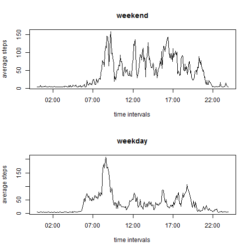

# Reproducible Research: Peer Assessment 1
=======================================================

## Loading and preprocessing the data


```r
data <- read.csv("activity.csv")
```


## What is mean total number of steps taken per day?


```r
TotalStepEachDay <- tapply(data[, 1], data[, 2], sum)
hist(TotalStepEachDay, breaks = 20, main = "total number of steps taken per day", xlab = "number of steps", ylab = "frequency")
```

 

```r
mean <- mean(TotalStepEachDay, na.rm = TRUE)
median <- median(TotalStepEachDay, na.rm = TRUE)
```

The <b>mean</b> total number of steps taken per day is 1.0766 &times; 10<sup>4</sup> and the <b>median</b> is 10765.


## What is the average daily activity pattern?


```r
AvrStep <- tapply(data[, 1], data[, 3], mean, na.rm = TRUE)
library(chron)
time <- times(0:287/288)
time <- strptime(time, "%H:%M")
plot(time, AvrStep, type = "l", main = "Average Daily Activity Pattern", xlab = "time intervals", ylab = "average steps")
```

 

```r
max <- max(AvrStep)
interval <- names(AvrStep)[which(AvrStep == max)]
nextint <- as.numeric(interval) + 5
```

The <b>835-840 5-minute interval</b> on average across all the days in the dataset, contains the maximum number of steps.


## Imputing missing values


```r
nanumber <- sum(is.na(data))
```

The total number of missing values in the dataset is 2304.

Code for replacing all missing values by the average number of steps and create a new dataset. 

```r
newdata <- data
newdata$steps[is.na(newdata$steps)] = mean(newdata$steps, na.rm=TRUE)
```


Calculate total number of steps taken per day and the mean and median with the new dataset.

```r
NewTotalStepEachDay <- tapply(newdata[, 1], newdata[, 2], sum)
hist(NewTotalStepEachDay, breaks = 20, main = "total number of steps taken per day without missing values", xlab = "number of steps", ylab = "frequency")
```

 

```r
newmean <- mean(NewTotalStepEachDay, na.rm = TRUE)
newmedian <- median(NewTotalStepEachDay, na.rm = TRUE)
```

WIh the missing values replaced, the <b>mean</b> total number of steps taken per day is 1.0766 &times; 10<sup>4</sup> and the <b>median</b> is 1.0766 &times; 10<sup>4</sup>.

The new median differs from the first estimate whereas the new mean does not, for missing values were replaced by the original mean of steps. Imputing missing values only changes total daily number steps of those days with missing values. 


## Are there differences in activity patterns between weekdays and weekends?

First, create a new 2-level factor variable called "weekday".

```r
newdata$day <- c("Sunday", "Monday", "Tuesday", "Wednesday", "Thursday", "Friday", "Saturday")[as.POSIXlt(newdata$date)$wday + 1]

newdata$weekday <- ifelse(newdata$day %in% c("Sunday", "Saturday"), c("weekend"), c("weekday"))
newdata$weekday <- as.factor(newdata$weekday)
```


Then, make a panel plot containing a time series plotof the 5-minute interval (x-axis) and the average number of steps taken, averaged across all weekday days or weekend days (y-axis).

```r
X <- split(newdata, newdata$weekday)
Y <- lapply(seq_along(X), function(x) as.data.frame(X[[x]])[, 1:3])
weekday <- Y[[1]]
weekend <- Y[[2]]
WeekdayAvrStep <- tapply(weekday[, 1], weekday[, 3], mean, na.rm = TRUE)
WeekendAvrStep <- tapply(weekend[, 1], weekend[, 3], mean, na.rm = TRUE)

par(mfrow = c(2, 1))
plot(time, WeekendAvrStep, type = "l", main = "weekend", xlab = "time intervals", ylab = "average steps")
plot(time, WeekdayAvrStep, type = "l", main = "weekday", xlab = "time intervals", ylab = "average steps")
```

 


